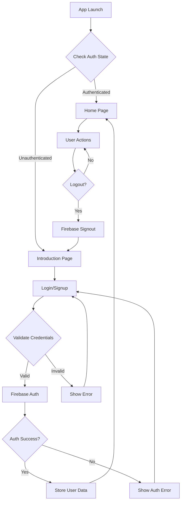
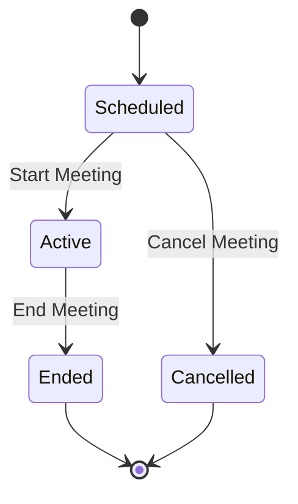

# MyZoom Clone - Complete Documentation

## 📋 Table of Contents
1. [Project Overview](#project-overview)
2. [Architecture](#architecture)
3. [Project Structure](#project-structure)
4. [Core Features](#core-features)
5. [Technology Stack](#technology-stack)
6. [Database Schema](#database-schema)
7. [Authentication Flow](#authentication-flow)
8. [Meeting Management](#meeting-management)
9. [State Management](#state-management)
10. [Dependency Injection](#dependency-injection)
11. [Setup & Installation](#setup--installation)
12. [API Reference](#api-reference)
13. [UI/UX Design](#uiux-design)
14. [Error Handling](#error-handling)
15. [Testing Strategy](#testing-strategy)
16. [Future Enhancements](#future-enhancements)

## 🎯 Project Overview

MyZoom Clone is a Flutter-based video conferencing application built using Clean Architecture principles. The app provides user authentication, meeting creation, meeting joining, and user profile management functionalities.

### Key Objectives
- **Scalable Architecture**: Clean Architecture for maintainable code
- **Real-time Data**: Firebase Firestore for live updates
- **State Management**: BLoC pattern for predictable state changes
- **Modern UI**: Material Design 3 with custom theming
- **Offline Support**: Local data persistence with SharedPreferences

## 🏗️ Architecture

The app follows **Clean Architecture** principles with clear separation of concerns:

```
┌─────────────────┐    ┌─────────────────┐    ┌─────────────────┐
│   Presentation  │───▶│     Domain      │◀───│      Data       │
│     Layer       │    │     Layer       │    │     Layer       │
└─────────────────┘    └─────────────────┘    └─────────────────┘
         │                       │                       │
    ┌─────────┐            ┌──────────┐            ┌──────────┐
    │ UI/BLoC │            │Entities  │            │Models    │
    │ Widgets │            │Use Cases │            │DataSrc   │
    │ Pages   │            │Repository│            │Repository│
    └─────────┘            │Interface │            │Impl      │
                          └──────────┘            └──────────┘
```

### Architecture Benefits
- **Testability**: Each layer can be tested independently
- **Maintainability**: Changes in one layer don't affect others
- **Scalability**: Easy to add new features without breaking existing code
- **Flexibility**: Can swap implementations (e.g., database providers)

## 📁 Project Structure

```
lib/
├── 🎯 core/                     # Core utilities and shared resources
│   ├── constants/               # App-wide constants
│   ├── error/                   # Error handling classes
│   ├── network/                 # Network utilities
│   ├── theme/                   # App theming
│   ├── utils/                   # Utility functions
│   └── di/                      # Dependency injection setup
│
├── 🏢 domain/                   # Business logic layer
│   ├── entities/                # Business objects
│   ├── repositories/            # Repository interfaces
│   └── usecases/                # Business use cases
│       ├── auth/                # Authentication use cases
│       └── meeting/             # Meeting use cases
│
├── 📊 data/                     # Data access layer
│   ├── models/                  # Data models
│   ├── datasources/             # Data source implementations
│   └── repositories/            # Repository implementations
│
└── 🎨 presentation/             # UI layer
    ├── bloc/                    # State management
    │   ├── auth/                # Authentication BLoC
    │   └── meeting/             # Meeting BLoC
    ├── pages/                   # App screens
    │   ├── auth/                # Authentication pages
    │   ├── home/                # Home and profile pages
    │   └── meeting/             # Meeting pages
    └── widgets/                 # Reusable UI components
```

## 🚀 Core Features

### 1. **User Authentication**
- ✅ Email/Password registration
- ✅ Email/Password login
- ✅ Auto login persistence
- ✅ Secure logout
- ✅ Real-time auth state monitoring
- ✅ User profile management

### 2. **Meeting Management**
- ✅ Create scheduled meetings
- ✅ Join meetings with ID
- ✅ Password-protected meetings
- ✅ Meeting duration settings
- ✅ Recording options
- ✅ Meeting history

### 3. **User Interface**
- ✅ Modern Material Design 3
- ✅ Custom gradient themes
- ✅ Responsive layouts
- ✅ Form validation
- ✅ Loading states
- ✅ Error handling UI

### 4. **Data Management**
- ✅ Real-time Firestore sync
- ✅ Offline data persistence
- ✅ Automatic error recovery
- ✅ Network connectivity checks

## 🛠️ Technology Stack

### **Frontend Framework**
- **Flutter**: Cross-platform mobile development
- **Dart**: Programming language

### **State Management**
- **flutter_bloc**: Predictable state management
- **equatable**: Value equality for state objects

### **Backend Services**
- **Firebase Auth**: User authentication
- **Cloud Firestore**: NoSQL database
- **Firebase Core**: Firebase initialization

### **Dependency Injection**
- **get_it**: Service locator
- **injectable**: Code generation for DI

### **Networking**
- **dio**: HTTP client for API calls
- **dartz**: Functional programming utilities

### **UI/UX**
- **google_fonts**: Typography
- **flutter_gradient_colors**: Gradient themes

### **Local Storage**
- **shared_preferences**: Key-value storage

## 🗄️ Database Schema

### **Cloud Firestore Collections**

#### **Users Collection** (`users`)
```json
{
  "userId": {
    "email": "user@example.com",
    "name": "John Doe",
    "profileImageUrl": "https://...",
    "createdAt": "2025-10-11T10:30:00Z",
    "updatedAt": "2025-10-11T10:30:00Z"
  }
}
```

#### **Meetings Collection** (`meetings`)
```json
{
  "meetingId": {
    "title": "Team Standup",
    "description": "Daily team meeting",
    "hostId": "userId123",
    "hostName": "John Doe",
    "scheduledAt": "2025-10-12T09:00:00Z",
    "durationInMinutes": 60,
    "status": "scheduled", // scheduled, active, ended, cancelled
    "participantIds": ["userId1", "userId2"],
    "password": "optional_password",
    "isRecordingEnabled": false,
    "createdAt": "2025-10-11T10:30:00Z",
    "updatedAt": "2025-10-11T10:30:00Z"
  }
}
```

## 🔐 Authentication Flow



### Authentication States
- **Initial**: App starting up
- **Loading**: Authentication in progress
- **Authenticated**: User logged in
- **Unauthenticated**: User not logged in
- **Error**: Authentication failed

## 🎪 Meeting Management

### Meeting Lifecycle



### Meeting Operations

#### **Create Meeting**
```dart
// Use Case
CreateMeetingParams(
  title: "Team Meeting",
  description: "Weekly sync",
  scheduledAt: DateTime.now().add(Duration(hours: 1)),
  durationInMinutes: 60,
  password: "optional",
  isRecordingEnabled: false,
)
```

#### **Join Meeting**
```dart
// Use Case
JoinMeetingParams(
  meetingId: "meeting123",
  password: "optional",
)
```

## 🎛️ State Management

### BLoC Pattern Implementation

#### **AuthBloc States**
```dart
enum AuthStatus {
  initial,    // App starting
  loading,    // Processing auth
  authenticated,  // User logged in
  unauthenticated, // User not logged in
  error,      // Auth failed
}
```

#### **MeetingBloc States**
```dart
enum MeetingStatus {
  initial,    // No operations
  loading,    // Processing request
  success,    // Operation successful
  error,      // Operation failed
}
```

### Event-Driven Architecture
```dart
// Auth Events
AuthStarted()                    // Initialize auth
AuthSignInRequested()           // Login attempt
AuthSignUpRequested()           // Registration attempt
AuthSignOutRequested()          // Logout attempt
AuthUserChanged()               // Auth state changed

// Meeting Events
MeetingCreateRequested()        // Create meeting
MeetingJoinRequested()          // Join meeting
MeetingLoadUserMeetings()       // Load user's meetings
```

## 💉 Dependency Injection

### Service Registration
```dart
// External Dependencies
SharedPreferences ──┬── SharedPreferencesHelper
FirebaseAuth       ──┼── AuthRemoteDataSource
FirebaseFirestore  ──┼── MeetingRemoteDataSource
Dio               ───┘

// Repositories
AuthRemoteDataSource ── AuthRepository
MeetingRemoteDataSource ── MeetingRepository

// Use Cases
AuthRepository ── Auth Use Cases
MeetingRepository ── Meeting Use Cases

// BLoCs
Use Cases ── BLoCs
```

### Manual DI Setup
```dart
// Core services
getIt.registerLazySingleton<NetworkInfo>(() => NetworkInfo(getIt()));

// Data sources
getIt.registerLazySingleton<AuthRemoteDataSource>(
  () => AuthRemoteDataSourceImpl(getIt(), getIt()),
);

// Repositories
getIt.registerLazySingleton<AuthRepository>(
  () => AuthRepositoryImpl(
    remoteDataSource: getIt(),
    networkInfo: getIt(),
  ),
);

// Use cases
getIt.registerLazySingleton(() => SignInWithEmailAndPassword(getIt()));

// BLoCs
getIt.registerFactory(() => AuthBloc(/* dependencies */));
```

## ⚙️ Setup & Installation

### Prerequisites
- Flutter SDK (3.9.2+)
- Dart SDK
- Firebase Project
- Android Studio / VS Code

### Installation Steps

1. **Clone Repository**
```bash
git clone <repository-url>
cd myzoom_clone
```

2. **Install Dependencies**
```bash
flutter pub get
```

3. **Firebase Setup**
```bash
# Install Firebase CLI
npm install -g firebase-tools

# Login to Firebase
firebase login

# Configure Firebase for Flutter
flutterfire configure
```

4. **Run Application**
```bash
flutter run
```

### Firebase Configuration

#### **Authentication Setup**
1. Enable Email/Password authentication in Firebase Console
2. Configure authorized domains
3. Set up security rules

#### **Firestore Setup**
1. Create Firestore database
2. Set up security rules:

```javascript
rules_version = '2';
service cloud.firestore {
  match /databases/{database}/documents {
    // Users can read/write their own data
    match /users/{userId} {
      allow read, write: if request.auth != null && request.auth.uid == userId;
    }
    
    // Meetings - users can create and read meetings they're involved in
    match /meetings/{meetingId} {
      allow read: if request.auth != null;
      allow create: if request.auth != null;
      allow update: if request.auth != null && 
        (request.auth.uid == resource.data.hostId || 
         request.auth.uid in resource.data.participantIds);
    }
  }
}
```

## 📡 API Reference

### Authentication APIs

#### **Sign In**
```dart
Future<Either<Failure, User>> signInWithEmailAndPassword({
  required String email,
  required String password,
});
```

#### **Sign Up**
```dart
Future<Either<Failure, User>> signUpWithEmailAndPassword({
  required String email,
  required String password,
  required String name,
});
```

#### **Sign Out**
```dart
Future<Either<Failure, void>> signOut();
```

### Meeting APIs

#### **Create Meeting**
```dart
Future<Either<Failure, Meeting>> createMeeting({
  required String title,
  required String description,
  required DateTime scheduledAt,
  required int durationInMinutes,
  String? password,
  bool isRecordingEnabled = false,
});
```

#### **Join Meeting**
```dart
Future<Either<Failure, Meeting>> joinMeeting({
  required String meetingId,
  String? password,
});
```

#### **Get User Meetings**
```dart
Future<Either<Failure, List<Meeting>>> getUserMeetings({
  required String userId,
});
```

## 🎨 UI/UX Design

### Design System

#### **Color Palette**
```dart
// Primary Colors
static const Color primaryColor = Colors.blue;
static const Color secondaryColor = Colors.lightBlue;
static const Color backgroundColor = Colors.white;
static const Color errorColor = Colors.red;

// Gradients
static LinearGradient blueGradient = LinearGradient(
  colors: GradientColors.blue
);
```

#### **Typography**
```dart
// Font Families
- Raleway: Body text, captions
- Montserrat: Headings, titles

// Font Weights
- Regular (400): Body text
- Medium (500): Subheadings
- Bold (700): Headings
```

#### **Components**
- **Buttons**: Elevated with gradient backgrounds
- **Forms**: Outlined text fields with validation
- **Cards**: Material cards with subtle shadows
- **Navigation**: Bottom navigation with icons
- **Loading**: Circular progress indicators

### Screen Layouts

#### **Authentication Screens**
- Gradient background with centered content
- Card-based forms with validation
- Loading states during authentication

#### **Home Screen**
- Bottom navigation (Meetings, Profile)
- Tab-based meeting management
- User profile with sign-out option

#### **Meeting Screens**
- Form-based meeting creation
- Meeting joining with ID input
- Date/time pickers for scheduling

## ⚠️ Error Handling

### Error Types
```dart
// Domain Errors
abstract class Failure {
  final String message;
}

class AuthFailure extends Failure {}
class NetworkFailure extends Failure {}
class ServerFailure extends Failure {}
class ValidationFailure extends Failure {}
class MeetingFailure extends Failure {}
```

### Error Handling Strategy

#### **Data Layer**
```dart
try {
  // Firebase operation
} on FirebaseAuthException catch (e) {
  throw AuthException(e.message ?? 'Auth failed');
} catch (e) {
  throw ServerException(e.toString());
}
```

#### **Repository Layer**
```dart
if (await networkInfo.isConnected) {
  try {
    final result = await dataSource.operation();
    return Right(result);
  } on AuthException catch (e) {
    return Left(AuthFailure(e.message));
  }
} else {
  return Left(NetworkFailure('No internet'));
}
```

#### **Presentation Layer**
```dart
BlocListener<AuthBloc, AuthState>(
  listener: (context, state) {
    if (state.status == AuthStatus.error) {
      ScaffoldMessenger.of(context).showSnackBar(
        SnackBar(content: Text(state.errorMessage!)),
      );
    }
  },
  child: // UI widgets
)
```

## 🧪 Testing Strategy

### Testing Pyramid

#### **Unit Tests** (Domain Layer)
```dart
// Test use cases
test('should sign in user with valid credentials', () async {
  // Arrange
  when(mockRepository.signIn(any, any))
    .thenAnswer((_) async => Right(tUser));
  
  // Act
  final result = await useCase(SignInParams('email', 'password'));
  
  // Assert
  expect(result, Right(tUser));
});
```

#### **Widget Tests** (Presentation Layer)
```dart
testWidgets('should show loading indicator when state is loading', (tester) async {
  // Arrange
  when(mockBloc.state).thenReturn(AuthState(status: AuthStatus.loading));
  
  // Act
  await tester.pumpWidget(testWidget);
  
  // Assert
  expect(find.byType(CircularProgressIndicator), findsOneWidget);
});
```

#### **Integration Tests**
```dart
testWidgets('complete authentication flow', (tester) async {
  // Test full user journey from login to home screen
});
```

### Mocking Strategy
- **MockFirebaseAuth**: Mock authentication
- **MockFirestore**: Mock database operations
- **MockNetworkInfo**: Mock connectivity

## 🚀 Future Enhancements

### Phase 1: Video Calling
- **Agora RTC Integration**: Real-time video/audio
- **Screen Sharing**: Share screen during meetings
- **Chat System**: In-meeting text chat
- **Recording**: Meeting recording functionality

### Phase 2: Advanced Features
- **Calendar Integration**: Sync with device calendar
- **Push Notifications**: Meeting reminders
- **File Sharing**: Share documents in meetings
- **Breakout Rooms**: Split meetings into smaller groups

### Phase 3: Enterprise Features
- **Admin Dashboard**: Meeting analytics
- **User Management**: Organization-level controls
- **API Integration**: Third-party service integration
- **White Labeling**: Customizable branding

### Phase 4: Platform Expansion
- **Web Application**: Flutter Web support
- **Desktop Apps**: Windows/macOS/Linux
- **API Backend**: RESTful API service
- **Mobile Widgets**: iOS/Android widgets

## 📊 Performance Considerations

### Optimization Strategies
- **Lazy Loading**: Load data on demand
- **Image Caching**: Cache profile images
- **State Persistence**: Maintain state across app restarts
- **Connection Pooling**: Reuse network connections

### Monitoring
- **Firebase Analytics**: User behavior tracking
- **Crashlytics**: Crash reporting
- **Performance Monitoring**: App performance metrics

## 🔒 Security Best Practices

### Data Protection
- **Firebase Security Rules**: Server-side validation
- **Input Validation**: Client-side form validation
- **Authentication Tokens**: Secure token management
- **HTTPS Only**: All network requests encrypted

### Privacy
- **Data Minimization**: Collect only necessary data
- **User Consent**: Clear privacy policies
- **Data Retention**: Automatic data cleanup
- **GDPR Compliance**: European privacy regulations

---

## 📞 Support & Contribution

### Getting Help
- Check existing issues in the repository
- Create new issues with detailed descriptions
- Follow the issue templates provided

### Contributing
1. Fork the repository
2. Create feature branches
3. Write tests for new features
4. Submit pull requests with clear descriptions

### Code Style
- Follow Dart/Flutter conventions
- Use meaningful variable names
- Add documentation for public APIs
- Maintain consistent formatting

---

**Last Updated**: October 11, 2025  
**Version**: 1.0.0  
**Author**: MyZoom Clone Development Team
